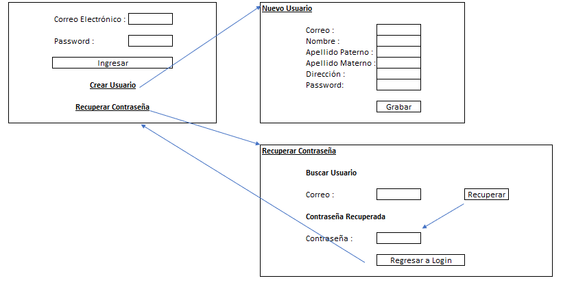

# Login en Java con JSP y Servlets
Desarrollo de una página de login con creación de usuario y recuperación de contraseña con JSP y Servlets Java. DB de usuarios en Mysql.

## Prototipo
Para la realización de la web de login se tuvo como base el siguiente prototipo:

